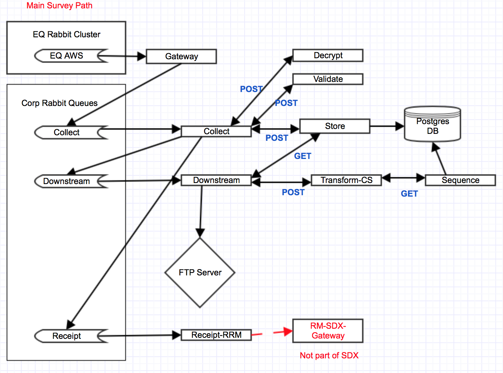
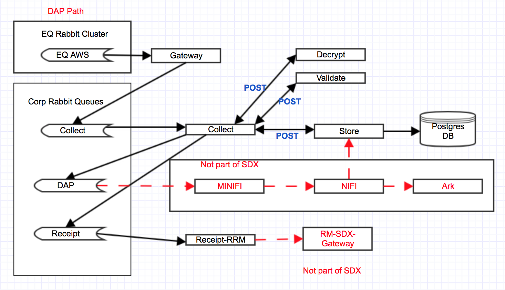
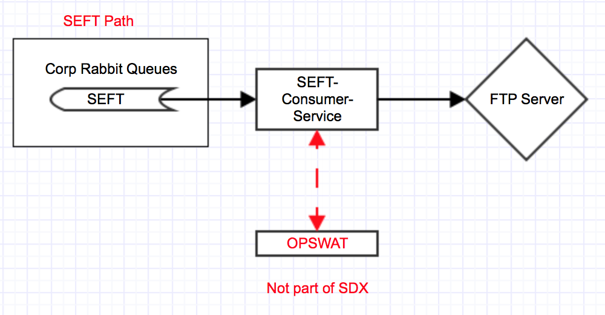

# sdx-compose

This repository allows you to spin up a local test environment for the ``sdx-`` suite of services.

### Prerequisites

 - make
 - docker
 - docker-compose
 - git
 - python3

### Getting started

Export a ``SDX_HOME`` environment variable. This should point at a folder into
which you wish to clone the rest of the services (e.g. ``/home/my-user/sdx``)
[see [configuration](#configuration)]

Set up a virtual environment using Python3 and ensure you activate it.

Clone this repository somewhere and run ``make``

```shell
$ git clone git@github.com:ONSdigital/sdx-compose.git
$ cd sdx-compose
$ make
```

This will attempt to clone the repositories into ``SDX_HOME`` and run their ``Dockerfile``'s

To git pull all the sdx repos (and to discover what branch each repo is on):

```shell
$ make update
```

To rebuild the services:

```shell
$ make build
```

Once built, you can bring the services up with:

```shell
$ make start
```

Once the services have started you can log in at localhost with:

username: admin
password: admin


### Configuration

``sdx-compose`` is not a service in itself, but requires an environment variable
to build and run other services.

| Environment variable | Default | Description
| -------------------- | ------- | -----------
| SDX_HOME             | _none_  | The folder to clone service repositories to


See the README files of each service for specific requirements they may have.
Each service is defaulted as best to run in the local environment using files
under [env](env)

### Logging

By default, all logging runs to the console. If you wish to re-enable ``syslog``
you can do so by uncommenting the ``logger`` lines in [docker-compose.yml](docker-compose.yml).

If you wish to change the log levels that are visible, then adding the following to `env/common.env` will change it:
```
LOGGING_LEVEL=INFO
```

### FTP Storage
Output files are stored locally in the pure-ftp-structure folder. To add new directories , add them here with a 
file called .placeholder checked into git so that git creates the folder.

### Architecture

Main Surveys


DAP


SEFT


### License

Copyright ©‎ 2016, Office for National Statistics (https://www.ons.gov.uk)

Released under MIT license, see [LICENSE](LICENSE) for details.
